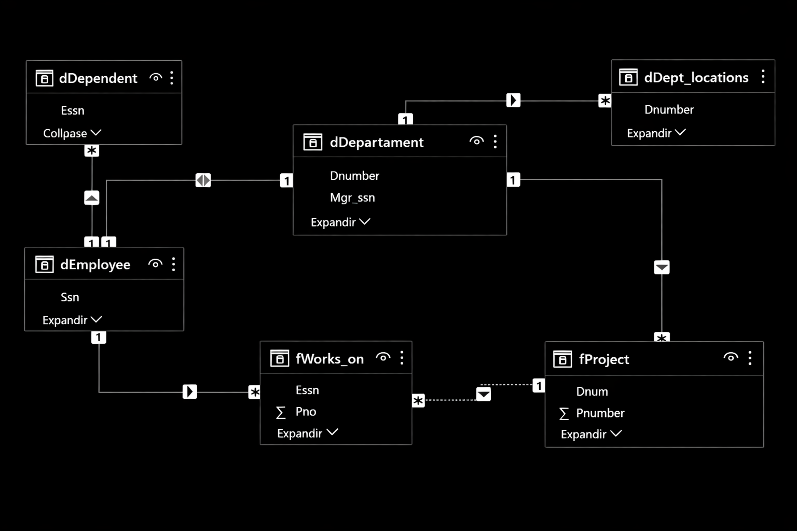
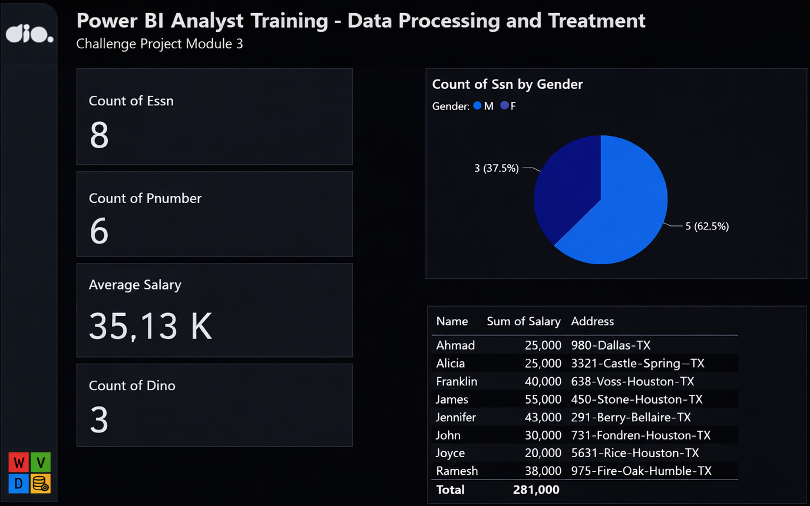

Daily learning

# Creating a corporate dashboard with integration to MySQL and Azure

Project developed at the Santander Bootcamp 2023 - Data Science with Python, under the guidance of specialist [Juliana Zanelatto](https://github.com/julianazanelatto/ "Juliana Zanelatto").
Applying the steps of data collection, retrieval, and transformation with Power BI and MySQL on Azure.

- **Description:** Create a database using MySQL, connect it to Power BI, process and manipulate the data, and create a simple visualization
- **Files:** `Dio-Challenge-Module03.pbix`

- **Steps:**

1. Create the company database in MySQL;
2. Run the script to create the database structure;
3. Run the data insert script;
4. Connect Power BI to MySQL;
5. Perform data transformation;
6. Create a simple visualization.

[LICENSE](/LICENSE)

See [original repository](https://github.com/julianazanelatto/power_bi_analyst).
